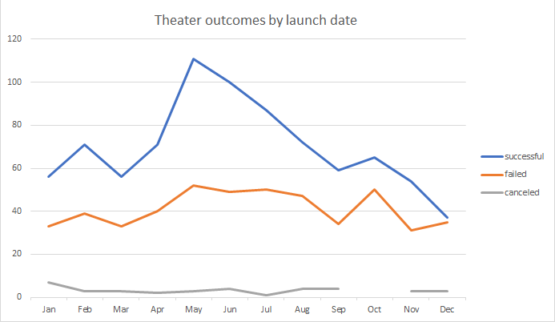
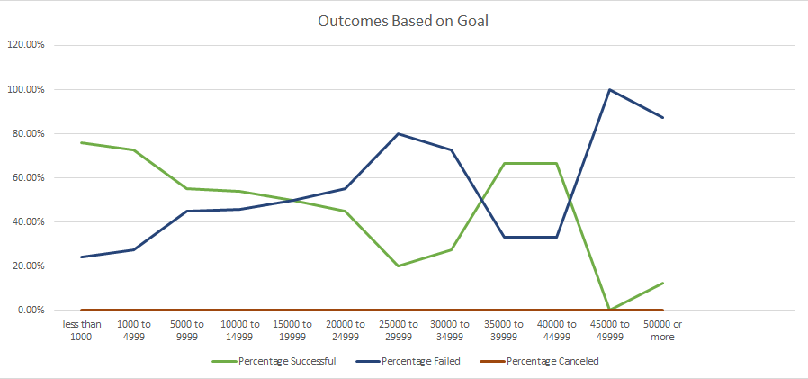

# Excel-Challenge
## Kickstarter analysis
### Overview of Project
The purpose of this report is to define how Louise's play *fever* fared as well as how other plays compared. The kickstarter data that was received was full of many parent categories such as: "film&video", "games", "photography", "theater", and so much more. Since this spreadsheet had so much data, I decided to focus more detail in the "theater" category. To narrow it down further, I filtered the data down to reflect the "plays" subcategory.
### Analysis and Challenges
#### Analysis
Once the data was reduced, I was able to create a better understanding of how *fever* compared to other plays. I began my analysis with finding how successful the outcomes were for kickstarters in the same Genre as Louise's play. To obtain this data I had to create a pivot table that could show me the number of "successful", "failed", and "canceled" kickstarters in any given month. To reduce the amount of noise, I filtered the pivot table to just "plays". After that, all we needed to do was adjust our table by just showing months instead of years or quarters. With these results, I was able to provide a chart showing the information we were looking for.

Then I created another sheet that looked at the outcomes based on each plays individual goal. A pivot chart did not work in this situation because there was a number of formulas that I needed to add in order to get the data I was looking for. Using the "countifs" formula I was able achieve the results I was looking for, along with basic math equations, the chart looked fantastic. 

#### Challenges
There were definitely some challenges that came with trying to get the right data. In the first sheet mentioned, I found the most difficult part was to get the columns and rows to reflect the data how I wanted it presented. The next difficult part was trying to get the months of the year to show instead of the quarters. In the second sheet mentioned, the formula was the most difficult to complete. There were so many paramaters in every row, and if I messed one of them up, the results would not compute correctly.

Here is an example of the formula that gave me trouble:
>=COUNTIFS(Kickstarter!$F:$F, "successful", Kickstarter!$D:$D, ">=5000", Kickstarter!$D:$D, "<10000", Kickstarter!$R:$R, "plays")

### Results
We were able to deduce that the greatest chance of success for kickstarter's in the "plays" category would be in the month of June. While May and July showed the next best successul outcomes. The results drastically dropped outside of the summer months. 

The second sheet showed us that greatest number of successful kickstarter's came from goals that were less than $5000 with a success percentage of about 75%. Although there were far fewer projects (9), goals between $35000 to $44999 also fared pretty successful with a success percentage of 66%. 

In Summary, to achieve a successful play kickstater, the best time to launch would be in June. The ideal goal would be less than $5000, but if the kickstarter calls for more than that, a goal between $35000 to $45000 would fare the next best odds of success. 